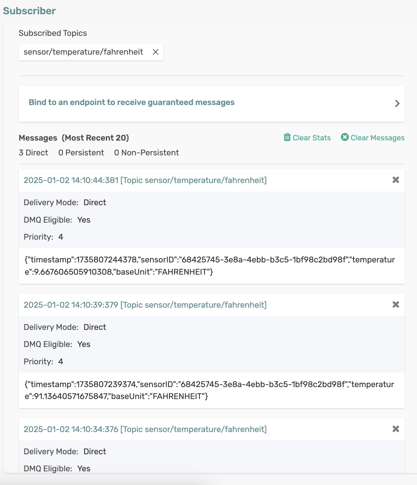

java -javaagent:/Users/mapatel/Downloads/opentelemetry-javaagent.jar -Dotel.javaagent.extensions=/Users/mapatel/.m2/repository/com/solace/solace-opentelemetry-jcsmp-integration/1.2.0-SNAPSHOT/solace-opentelemetry-jcsmp-integration-1.2.0-SNAPSHOT.jar -Dotel.traces.exporter=otlp -Dotel.javaagent.debug=true -Dotel.metrics.exporter=none -Dotel.logs.exporter=none -Dotel.instrumentation.http-url-connection.enabled=false -Dotel.instrumentation.jaxrs-client.enabled=false -Dotel.instrumentation.log4j.enabled=false -Dotel.instrumentation.jms.enabled=true -Dotel.instrumentation.grpc.enabled=false -Dotel.exporter.otlp.protocol=grpc -Dotel.resource.attributes=service.name=SCST_Source -Dotel.service.name=SCST_Source_Service -Dotel.propagators=solace_jcsmp_tracecontext -Dotel.exporter.otlp.endpoint=http://localhost:4317 -Dotel.bsp.schedule.delay=100 -Dotel.bsp.max.queue.size=2048 -Dotel.bsp.max.export.batch.size=5 -Dotel.bsp.export.timeout=10000 -Dsolace.java.host=tcp://localhost:55557 -Dotel.java.disabled.resource.providers=io.opentelemetry.instrumentation.resources.ProcessResourceProvider -jar target/cloud-stream-source-0.0.3-SNAPSHOT.jar


# cloud-stream-source - Using Spring Cloud Stream Supplier

The `FahrenheitTempSource` application is a Spring Boot application that leverages Spring Cloud Stream to produce sensor readings (objects of type `SensorReading`) to a message broker.

## Requirements

To run this sample, you will need to have installed:

- Java 17 or Above

## Code Tour

In the `FahrenheitTempSource` application, review the source code which generates and sends sensor readings.

```java
@Bean
public Supplier<SensorReading> emitSensorReading() {
  return () -> {
    double temperature = random.nextDouble() * RANDOM_MULTIPLIER;

    SensorReading reading = new SensorReading();
    reading.setSensorID(sensorIdentifier.toString());
    reading.setTemperature(temperature);
    reading.setBaseUnit(BaseUnit.FAHRENHEIT);

    log.info("Emitting " + reading);

    return reading;
  };
}
```


The function generates a *SensorReading* object and logs the sent sensor reading.

## Running the application

Make sure to update the Solace Broker connection details with the appropriate host, msgVpn, client username, and password in `application.yml`.

```sh
cd cloud-stream-source
mvn clean spring-boot:run
```

This will start the Spring Boot application.

You can see the source function generates and sends sensor readings as received by a subscriber via Solace Try-Me UI.

<p align="center"></p>

In the terminal, you can see the sent sensor readings.

```
2025-01-02T14:10:34.252+05:30  INFO 15691 --- [   scheduling-1] c.s.s.spring.scs.FahrenheitTempSource    : Emitting SensorReading [ 2025-01-02 14:10:34.245 68425745-3e8a-4ebb-b3c5-1bf98c2bd98f 74.8 FAHRENHEIT ]
2025-01-02T14:10:39.374+05:30  INFO 15691 --- [   scheduling-1] c.s.s.spring.scs.FahrenheitTempSource    : Emitting SensorReading [ 2025-01-02 14:10:39.374 68425745-3e8a-4ebb-b3c5-1bf98c2bd98f 91.1 FAHRENHEIT ]
2025-01-02T14:10:44.378+05:30  INFO 15691 --- [   scheduling-1] c.s.s.spring.scs.FahrenheitTempSource    : Emitting SensorReading [ 2025-01-02 14:10:44.378 68425745-3e8a-4ebb-b3c5-1bf98c2bd98f 9.7 FAHRENHEIT ]
```

🚀 Leverage the power of Spring Cloud Stream to build robust and scalable data production pipelines with ease! 🚀

